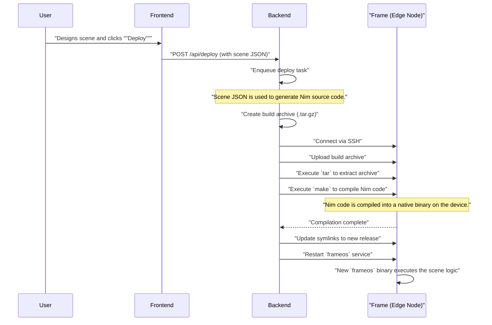
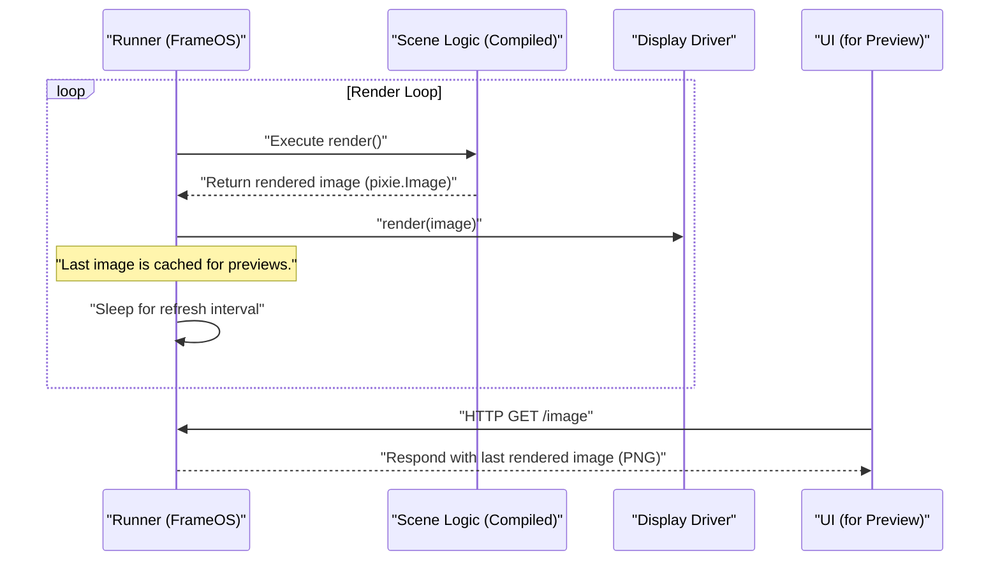
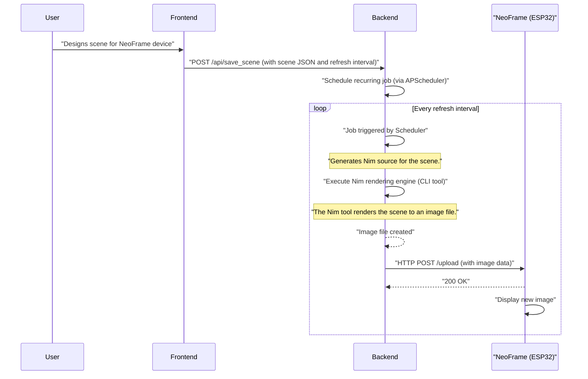

# FrameOS Architecture

This document outlines the architecture of the FrameOS system and proposes changes to support a new development workflow for ESP32-based "NeoFrame" devices.

## 1. Existing Architecture

The current FrameOS system is composed of three main components: a frontend UI, a backend control server, and the edge node software (FrameOS) that runs on the display-powering hardware, typically a Raspberry Pi.

### Components

*   **Frontend (UI)**: A React-based web application that allows users to define and configure "scenes". A scene is a collection of logical blocks (apps, data sources, schedules, etc.) that determine what is rendered on the frame's display. The user interacts with this UI in their web browser.
*   **Backend (Control Server)**: A Python FastAPI application, typically run in a Docker container. It serves the frontend, provides an API for managing frames and scenes, generates Nim source code from the scene definitions, and orchestrates the deployment of this code to the edge nodes.
*   **FrameOS (Edge Node)**: The software that runs on the edge device (e.g., Raspberry Pi). It's built on NixOS (for Raspberry Pi) and consists of a core application written in the Nim programming language. It is responsible for compiling the deployed scene code, executing it to render an image, and driving a physical display.

### Diagrams

#### System Architecture

```mermaid
graph TD
    subgraph User's Browser
        A["Frontend UI"]
    end

    subgraph Control Server (Docker)
        B["Backend API (Python/FastAPI)"]
        C["Code Generator (scene_nim.py)"]
    end

    subgraph Edge Node (Raspberry Pi)
        D["FrameOS (Nim Application)"]
        E["SSH Server"]
        F["Web Server (for previews)"]
        G["Display Driver"]
        H["Physical Display"]
    end

    User -- Interacts --> A
    A -- API Calls (REST/WebSocket) --> B
    B -- Generates Code --> C
    B -- Manages via SSH --> E
    E -- Controls --> D
    D -- Renders to --> G
    G -- Drives --> H
    D -- Serves Preview Image --> F
    F -- HTTP GET /image --> A
```

#### Deployment Sequence Diagram

This diagram illustrates the process of deploying a new scene configuration from the UI to an edge node.



#### Rendering Sequence Diagram

This diagram shows how a frame renders a scene and displays it.



## 2. Proposed Architecture for NeoFrame Development

The user wants to add support for an ESP32-based device called a "NeoFrame". This device has a simple web interface for uploading images, which is a departure from the SSH-based deployment and on-device compilation of the current system.

The proposal is to create a new development workflow that involves rendering the scene on the control server and then uploading the resulting image to the NeoFrame.

### User's Proposal Analysis

The user's idea to refactor the rendering process to happen on the control server is the most viable path forward for supporting devices like the ESP32-based NeoFrame, which do not have the resources to compile and run Nim code.

*   **"Control Server Render" App:** This is a logical necessity. The rendering process, currently handled by `frameos/src/frameos/runner.nim` on the edge device, needs to be executable on the control server.
*   **"Upload to Neoframe" App:** This app would bridge the gap between the rendered image on the server and the NeoFrame device, using the simple HTTP upload mechanism.

This approach is feasible and aligns with the goal of supporting a lightweight, ESP32-based device.

### Proposed Architecture for NeoFrame Support

To accommodate the NeoFrame, the following changes and additions to the architecture are proposed:

#### 1. Control Server Rendering

The core change is to shift the rendering responsibility from the edge device to the control server for NeoFrame devices.

*   **Nim Rendering Engine:** The rendering logic from `frameos/src/frameos/runner.nim` will be extracted into a standalone command-line tool. This tool will accept a scene definition (as JSON) and output a rendered image file (e.g., PNG). The control server (Python) will execute this tool to generate images.
*   **New "Device Type"**: A new "NeoFrame" device type will be introduced in the system. When a user configures a frame of this type, the backend will use the new rendering and deployment flow instead of the existing SSH-based process.

#### 2. "Upload to Neoframe" App

A new Frame App will be created to handle the upload of the rendered image to the NeoFrame.

*   **Functionality:** This app will be a simple HTTP client. Its configuration will include the IP address of the NeoFrame. When executed, it will take the path to a rendered image file and send it to the NeoFrame's upload endpoint via an HTTP POST request.

#### 3. Periodic Execution on the Control Server

To match the existing `refreshInterval` functionality, a scheduler will be added to the backend.

*   **Scheduler Integration:** A library such as `apscheduler` will be integrated into the Python backend.
*   **Dynamic Job Scheduling:** When a scene for a NeoFrame device is saved, the backend will schedule a recurring job based on the scene's `refreshInterval`. This job will:
    1.  Execute the Nim rendering engine to generate a fresh image of the scene.
    2.  Invoke the "Upload to Neoframe" app to push the new image to the device.

### Diagrams for Proposed Future State

#### System Architecture with NeoFrame Support

```mermaid
graph TD
    subgraph User's Browser
        A["Frontend UI"]
    end

    subgraph Control Server (Docker)
        B["Backend API (Python/FastAPI)"]
        C["Code Generator (scene_nim.py)"]
        I["Nim Rendering Engine (Command-line tool)"]
        J["Scheduler (APScheduler)"]
    end

    subgraph Edge Node (NeoFrame - ESP32)
        K["Web Server (for upload)"]
        L["Display Driver"]
        M["Physical Display"]
    end

    User -- Interacts --> A
    A -- API Calls --> B
    B -- Generates Code --> C
    B -- Executes --> I
    I -- Generates Image --> B
    J -- Triggers --> B
    B -- HTTP POST --> K
    K -- Updates --> L
    L -- Drives --> M
```

#### NeoFrame Deployment and Rendering Sequence Diagram



### Code Changes Required

*   **`frameos/` (Nim codebase):**
    *   Refactor `runner.nim` to extract the rendering logic into a command-line tool.
    *   Create a new "Upload to Neoframe" app in `frameos/src/apps/output/`.
*   **`backend/` (Python codebase):**
    *   Integrate `apscheduler` for periodic task execution.
    *   Modify `deploy_frame.py` to handle the "NeoFrame" device type, setting up scheduled rendering jobs instead of SSH deployment.
    *   Add logic to call the new Nim rendering CLI tool.
*   **`frontend/` (React codebase):**
    *   Add "NeoFrame" as a selectable device type.
    *   Update the UI to show the "Upload to Neoframe" app and its configuration (IP address) when a NeoFrame device is being edited.