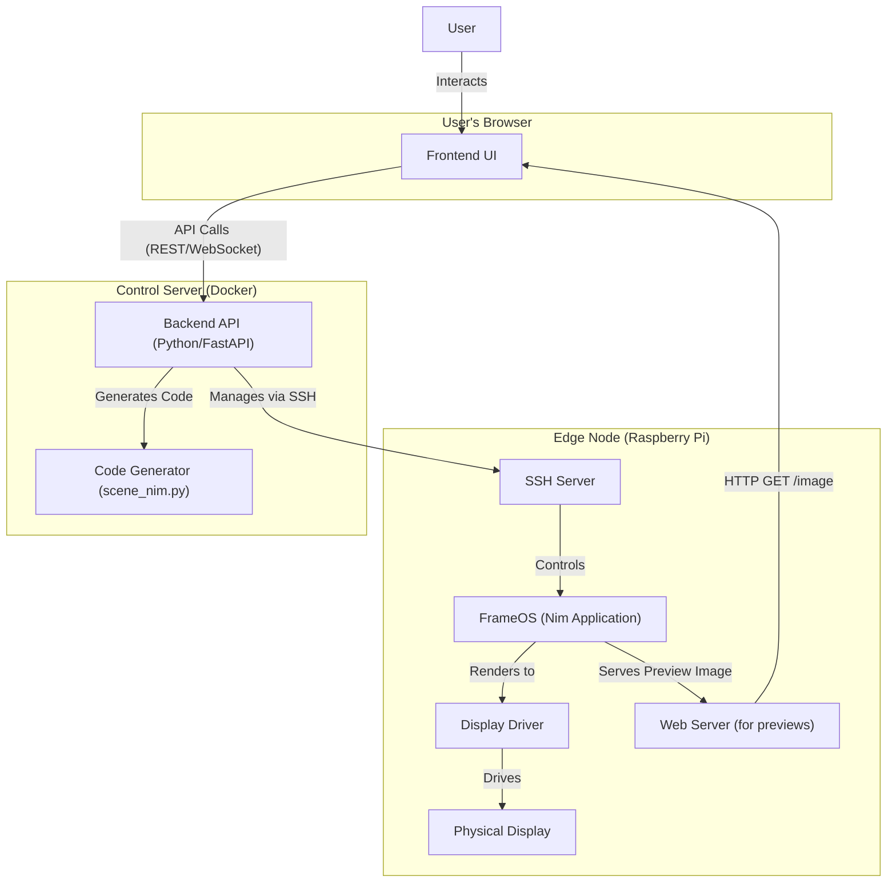
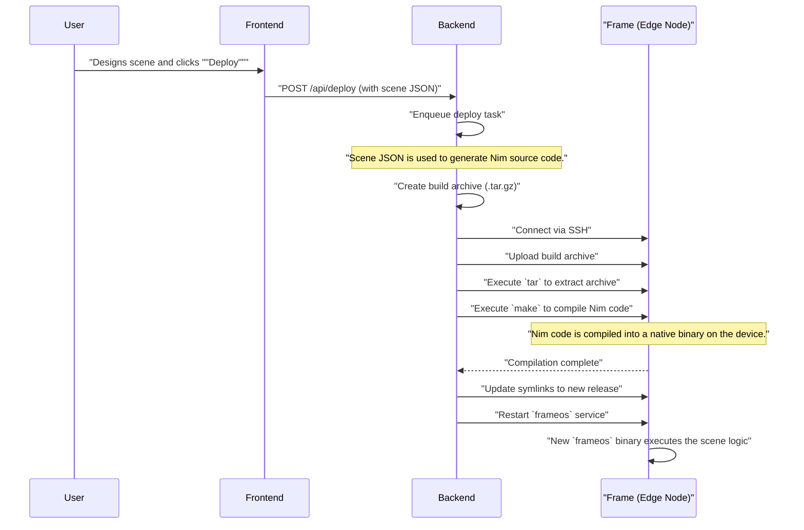
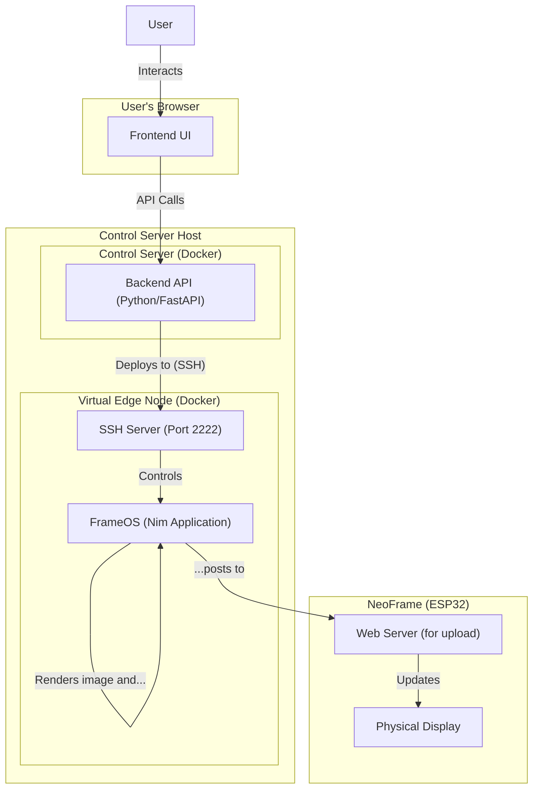

# FrameOS Architecture

This document outlines the architecture of the FrameOS system and proposes a new approach for supporting ESP32-based "NeoFrame" devices.

## 1. Existing Architecture

The current FrameOS system is composed of three main components: a frontend UI, a backend control server, and the edge node software (FrameOS) that runs on the display-powering hardware, typically a Raspberry Pi.

### Components

*   **Frontend (UI)**: A React-based web application that allows users to define and configure "scenes". A scene is a collection of logical blocks (apps, data sources, schedules, etc.) that determine what is rendered on the frame's display. The user interacts with this UI in their web browser.
*   **Backend (Control Server)**: A Python FastAPI application, typically run in a Docker container. It serves the frontend, provides an API for managing frames and scenes, generates Nim source code from the scene definitions, and orchestrates the deployment of this code to the edge nodes.
*   **FrameOS (Edge Node)**: The software that runs on the edge device (e.g., Raspberry Pi). It's built on NixOS (for Raspberry Pi) and consists of a core application written in the Nim programming language. It is responsible for compiling the deployed scene code, executing it to render an image, and driving a physical display.

### Diagrams

#### System Architecture

#### Deployment Sequence Diagram

## 2. Proposed Architecture for NeoFrame Support (Virtual Edge Node Approach)

This revised proposal adopts the user's suggestion to leverage the existing architecture by creating a "virtual" edge node that runs on the control server. This approach minimizes architectural changes and reuses the battle-tested deployment and rendering logic.

### Phase 1: Virtual Edge Node

#### Concept
Instead of rendering on the control server's backend process, we will run the existing `frameos` Nim application in a Docker container on the control server itself. This "virtual" edge node will be configured to render scenes and then, instead of driving a physical display, it will HTTP POST the rendered image to the target NeoFrame device.

#### Changes Required
1.  **Virtual Device Driver in FrameOS:**
    *   A new "device driver" will be created within the `frameos` Nim application.
    *   When this driver is selected (e.g., `device = "virtual-neoframe"` in `frame.json`), the `drivers.render(image)` function will not attempt to write to a physical display.
    *   Instead, it will take the rendered `image`, encode it to the format expected by the NeoFrame (e.g., PNG or BMP), and HTTP POST it to an upload URL (e.g., `http://<neoframe-ip>/upload`), which will be part of the device's configuration.

2.  **Control Server SSH Port Configuration:**
    *   The backend will be updated to allow specifying a custom SSH port when defining a frame. This allows the control server to connect to the virtual edge node container running locally on a non-standard port (e.g., 2222).

3.  **Deployment Workflow:**
    *   A user wanting to drive a NeoFrame will first start a `frameos` Docker container on their control server, mapping a unique SSH port (e.g., 2222) to the container's port 22.
    *   In the UI, they will add a new frame, providing the control server's IP, the custom SSH port, and credentials for the container.
    *   The scene will be designed as usual. The only difference is the device configuration will specify the `virtual-neoframe` driver and the target NeoFrame's IP address for the upload.
    *   The deployment process remains identical: the control server will SSH into the local container, upload the code, compile it, and restart the `frameos` service inside the container. The `frameos` service will then handle the rendering and forwarding to the actual NeoFrame.

#### Phase 1 Architecture Diagram

### Phase 2: Multi-Device Support (Future Enhancement)

To further optimize this, the `frameos` application could be enhanced to support multiple target devices from a single instance. This would eliminate the need to run one container per NeoFrame.

*   The `frame.json` would be extended to support a list of devices.
*   The `frameos` application would iterate through this list, rendering and uploading to each target device.

This would be a more invasive change but could significantly improve scalability for managing many virtual frames.